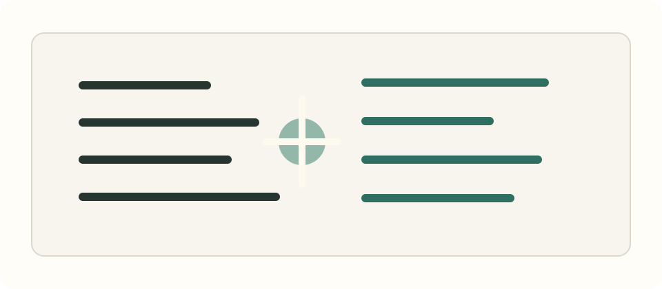

## 이번 주의 한 줄

좋은 기록은 내가 한 일을 크게 보이게 만드는 장식이 아니라, 다음 결정을 더 선명하게 만드는 도구라는 생각을 했다.

## 한 일

- 이력서만으로는 잘 드러나지 않는 일하는 방식을 보여주기 위해 개발레터 형식의 개인 사이트를 기획했다.
- 기술 블로그와 포트폴리오 사이에서 어떤 구조가 나다운지 정리했다.
- 매주 남길 수 있는 글의 리듬을 `한 일`, `생각한 것`, `배운 것`, `남겨둘 조각`으로 나누어 보았다.

## 생각한 것

개발자로서 나를 보여주는 일은 결과물을 나열하는 것만으로는 부족하다. 어떤 문제를 중요하게 봤는지, 협업 중 어디에서 기준을 세웠는지, 막혔을 때 어떤 순서로 풀었는지가 함께 보여야 한다.

그래서 이 사이트는 정답을 설명하는 공간보다 과정을 남기는 공간에 가깝게 시작하려고 한다. 완성된 결론만 적기보다, 한 주 동안 바뀐 판단과 다음에 가져갈 질문을 함께 남기는 쪽이 나를 더 정확히 보여줄 수 있다고 믿는다.

## 배운 것

작게라도 꾸준히 발행하려면 글쓰기의 구조가 먼저 필요하다. 매번 새 형식을 고민하면 기록이 무거워지기 때문에, 반복 가능한 섹션을 만들고 그 안에서 생각의 밀도를 쌓아가는 방식이 더 오래 갈 것 같다.

## 남겨둘 조각

- 좋은 회고는 후회 목록이 아니라 다음 실험의 출발점이어야 한다.
- 기술 선택은 취향이 아니라 맥락을 설명할 수 있을 때 힘이 생긴다.
- 다음 주에는 “프론트엔드 작업에서 사용자 경험을 어디까지 책임질 것인가”를 더 생각해보고 싶다.

